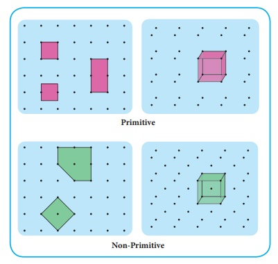
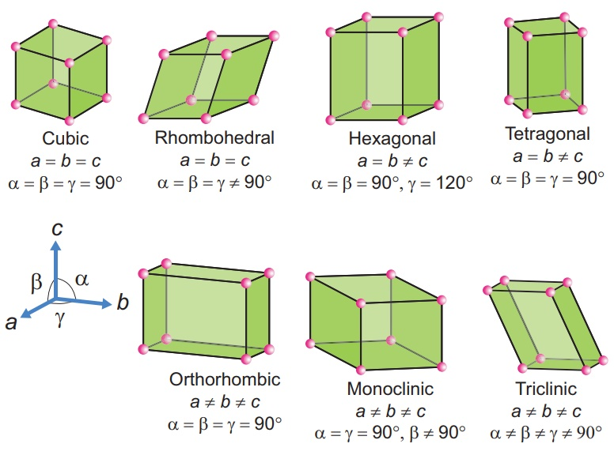
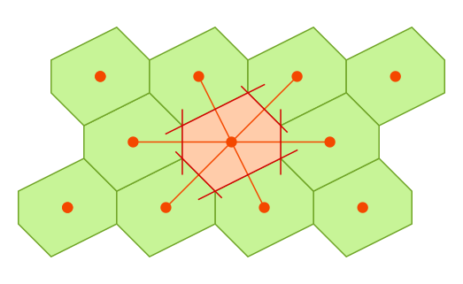

## Unit Cells

An ideal crystal is an infinite object which thus cannot be illustrated as a whole in a single image. Even if one could, this would not be desirable. Instead one can use the fact that a crystal is built up by smallest elements that are repeated in all directions, filling the whole space.

These elements are called unit cells and fulfil the following requirements:

- A repetitive arrangement (pure translation) of them can build up the whole crystal without overlaps/gaps.
- There is no further partition of the unit cell that could itself be used as a unit cell.

For a given crystal there are always quite a few possible unit cells:

  

### Primitive and non-primitive unit cell

There are two types of unit cells: primitive and non- primitive. A unit cell that contains only one lattice point is called a primitive unit cell, which is made up from the lattice points at each of the corners.It is the smallest possible cell. If there is a lattice point at the edge of a cell and thus shared with another cell, it is only counted half. Accordingly, a point located on the corner of a cube is shared by 8 cubes and would count with 1/8.

In case of non-primitive unit cells, there are additional lattice points, either on a face of the unit cell or with in the unit cell.

  

There are seven primitive crystal systems; cubic, tetragonal, orthorhombic, hexagonal, monoclinic, triclinic and rhombohedral. They differ in the arrangement of their crystallographic axes and angles. Corresponding to the above seven, Bravis defined 14 possible crystal systems as shown in the figure.

  

### Wigner-Seitz Cell

There is a special type of primitive-cells known as Wigner-Seitz cell. The Wigner-Seitz cell of a lattice point is defined as the volume that encloses all points in space which are closer to this particular lattice point than to any other. It can be constructed as depicted below

  

