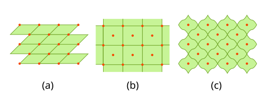
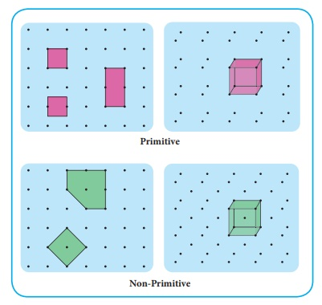
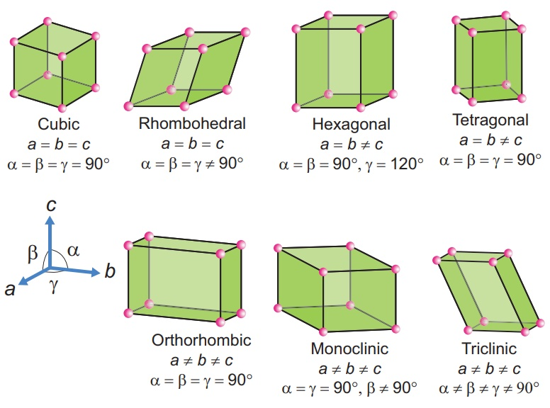

## What are Unit Cells?

An ideal lattice is an infinite, repeating array of points that can be used to model the periodic structure of a crystal. While a lattice itself is an abstract mathematical concept, a crystal is a physical structure that incorporates atoms at specific positions within the lattice. Because a crystal extends infinitely, it cannot be represented entirely in a single image. Instead, we focus on repeating elements within the lattice that fill the entire space.
These repeating elements are called **unit cells**, and they must fulfill the following conditions:
- A repetitive arrangement of unit cells can build the entire crystal without gaps or overlaps.
- The unit cell cannot be subdivided further into smaller unit cells that could serve the same purpose.

For a given crystal, there are various possible choices of unit cells, as shown in the example below:

  

### Primitive and Non-Primitive Unit Cells 

There are two main types of unit cells: **primitive** and **non-primitive**.
- A primitive unit cell contains exactly one lattice point. This means that the unit cell is the smallest repeating unit that, when translated, can create the entire lattice. Atoms located at the vertices of the unit cell are shared between adjacent unit cells, so each vertex contributes $ 1/8 $  of an atom to the unit cell. In a cubic lattice, with 8 vertices, this gives a total of 1 atom per primitive unit cell.
- A non-primitive unit cell contains more than one lattice point, often with additional points located on the faces or within the interior of the unit cell.

  

There are seven primitive crystal systems: cubic, tetragonal, orthorhombic, hexagonal, monoclinic, triclinic, and rhombohedral. These systems differ in the arrangement of their crystallographic axes and angles, as shown in the figure below. Based on these crystal systems, **14 Bravais lattices** are defined, which are the standard types of lattices used to describe crystal structures.

  

