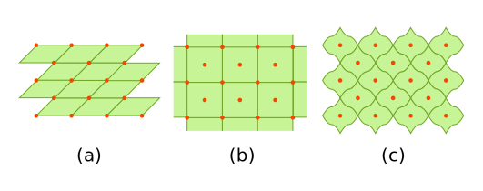

## What are unit cells?

An ideal crystal is an infinite object. Thus, it cannot be illustrated as a whole in a single image. Even if it was possible, it isn't desirable. Instead we can use the fact that a crystal is built up by smaller elements that are repeated in all directions, filling the whole space.

These elements are called unit cells and fulfil the following requirements:

- A repetitive arrangement (pure translation) of them can build up the whole crystal without overlaps/gaps.
- There is no further partition of the unit cell that could itself be used as a unit cell.

For a given crystal, there are always quite a few possible unit cells as we can see in the below example:

  

### Primitive and non-primitive unit cell

There are two types of unit cells: primitive and non-primitive unit cell. An unit cell that contains only one lattice point in it is called a primitive unit cell and usually these kind of unit cells have an atom in each vertice of the cell. The concept of only one lattice point being contained in a primitive unit cell comes from a simple calculation. An atom in a vertice of a cell can be shared among other unit cells and in the case of a cube, it is 8 cells sharing one atom. This equates to the unit cell having 1/8 of an atom in one vertice. Since it has 8 vertices, the number of atoms comes out to be 1. A primitive unit cell is the smallest possible unit cell.

In the case of non-primitive unit cells, there are additional lattice points, either on a face of the unit cell or within the unit cell iself, resulting in more than one lattice point per unit cell.

  

There are seven primitive crystal systems: cubic, tetragonal, orthorhombic, hexagonal, monoclinic, triclinic and rhombohedral. They differ in the arrangement of their crystallographic axes and angles as we can see in the figure below. Corresponding to the above seven arrangement of atoms, Bravais defined 14 possible crystal systems which are now known as the standard Bravais lattices.

  

### Wigner-Seitz Cell

There is a special type of primitive-cell known as Wigner-Seitz cell. The Wigner-Seitz cell of a lattice point is defined as the volume that encloses all points in space which are closer to the selected lattice point than to any other lattice point. It can be constructed as depicted below

  

